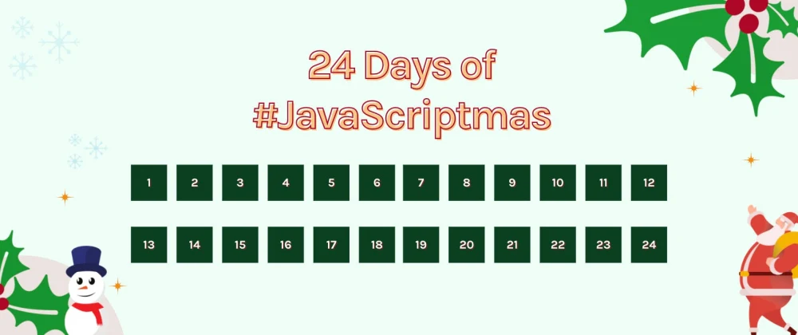

# My #JavaScriptmas Solutions!

هنا أشارك تجاربي في تحدّي جافاسكريبتماس لعام 2021 لأرشفتها و لتذكير نفسي بأن البقاء داخل منطقة الراحة غير مريح؛ كلانا يا صديقي نحتاج لبعض التحدّي.

عرفت Scrimba منذ عامين و عرفت JavaScriptmas منذ بدايته في العام الماضي، قابلني تحدي جافاسكريبتماس الماضي بترحاب شديد و كأنه مصمم خصيصًا لي! احتجت حينها أن أمارس البرمجة بشكل دوري و أن أقرأ أكثر في الأساسيات و هو ما أجبرتني عليه مشاركتي في التحدّي.  
كان تحدي جافاسكريبتماس في العام الماضي قائم على ممارسة الأساسيات بكثرة. كان يعوّدنا على الأساسيات كي يَسهُل البناء عليها بعد ذلك؛ و هو ما حدث معي بالفعل.

تحدي عام 2021 مختلف عن الماضي حيث أنهم يركّزون على Theme خاص به قريب أكثر لفترة الكريسماس.  
أما أنا فأدخل تحدّي هذا العام لتجربة أمور لم أجربها خلال الفترة الماضية. أدخل تحدّي هذا العام كي أتحدّى نفسي و ذهني لقضاء شهر من الإنجاز.

في العام الماضي ذُكِرت إحدى مشاركاتي كواحدة من أفضل ثلاث مشاركات خلال الشهر و هذا أمر حفّزني كثيرًا لأنتج المزيد. أرغب هذا العام أن تُذكَر على الأقل واحدة من مشاركاتي أيضًا كما حدث في المرة السابقة. و أود أن تكون مشاركة تستحق أن أفخر بها.

فلنخرج جميعًا من مناطق راحتنا.
دمت سعيدًا ✨

Day 1. [Countdown To Christmas](./1.countdown-to-christmas)  
Day 2. [Toggle Christmas Theme](./2.toggle-christmas-theme)  
Day 3. [Don't Scare Your Relatives](./3.dont-scare-your-relatives)  
Day 4. [Shopping Checklist](./4.shopping-checklist)  
Day 5. [Christmas Card Writer](./5.christmas-card-writer)
